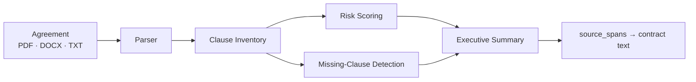

<p align="center">
  
</p>

<div align="center">

# ⚖️ LexMind AI

**AI legal contract review, grounded in the text it reads.**

</div>

> **LexMind is a review assistant, not a draft or review tool.** It never
> invents clauses, legislation, or facts. Every conclusion cites the contract
> text it was asked to read — see `app/prompts/skills.py`.

---

## The Brief

A FastAPI + LangGraph pipeline that ingests a legal agreement (PDF, DOCX, or
plain text), inventories its clauses, scores risk, flags missing protections,
and produces an evidence-backed executive summary with negotiation
recommendations — each finding traceable to the source text.

**Status:** MVP code scaffold. Deliberately narrow scope, production-quality
foundations.

---

## How It Works

1. **Parse** — normalize PDF / DOCX / TXT into clean text
   (`app/parsers/`)
2. **Inventory** — identify and catalogue the agreement's clauses
3. **Assess** — score risk per clause against skill-specific prompts
   (`app/prompts/skills.py`)
4. **Detect** — surface missing clauses a careful reviewer would expect
5. **Report** — executive summary + negotiation recommendations, with
   `source_spans` pointing back into the contract



---

## Repository Layout

```
lexmind/
├── backend/
│   ├── app/
│   │   ├── main.py          # FastAPI entrypoint
│   │   ├── api/reviews.py   # POST /api/v1/reviews · GET /api/v1/health
│   │   ├── core/config.py   # settings from environment / .env
│   │   ├── llm/client.py    # mock | anthropic | openai | ollama
│   │   ├── parsers/         # pdf / docx / txt normalization
│   │   ├── prompts/skills.py # one prompt template per pipeline skill
│   │   ├── schemas/         # Pydantic output contracts (JSON schemas)
│   │   ├── workflow/        # LangGraph state, nodes, graph, service
│   │   └── scripts/run_review.py  # CLI runner
│   ├── tests/
├── examples/
│   ├── contracts/           # sample gas supply agreement
│   └── output/              # generated review JSON
├── eval/
│   └── test_contracts/      # labelled corpus for precision/recall
├── docs/
└── fly.toml                 # Fly.io deployment (syd)
```

---

## Running

```bash
cd backend
python -m venv .venv && .venv\Scripts\activate   # Windows
pip install -r requirements.txt

# CLI (deterministic mock LLM — no API key needed)
python -m app.scripts.run_review ../examples/contracts/sample_gas_supply_agreement.txt

# API
uvicorn app.main:app --reload
# open http://127.0.0.1:8000/docs
```

---

## Configuring a Real LLM

Copy `.env.example` to `.env` and set `LLM_PROVIDER`:

| Provider | Notes |
| --- | --- |
| `anthropic` | Default model `claude-sonnet-4-20250514` |
| `openai` | — |
| `ollama` | Local, offline |

The pipeline is provider-agnostic; the mock is deterministic and offline, so
the test suite and CLI run with **no API key**.

---

## Tests

```bash
cd backend
pytest -q
```

---

## Design Notes

- **Traceable evidence** — every risk conclusion carries `source_spans`
  pointing back into the contract text (PRD AI principles)
- **JSON contracts** — all output models live in `app/schemas/`, shared by the
  pipeline and the API
- **Composable graph** — the workflow is a compiled LangGraph in
  `app/workflow/graph.py`; nodes are pure functions in `nodes.py`, individually
  testable and replaceable

---

## Out of Scope (v1)

Contract drafting, Word redlining, multi-user collaboration, version
comparison, e-signatures, billing, workflow automation, and case-law retrieval.
See the PRD for the full roadmap.
